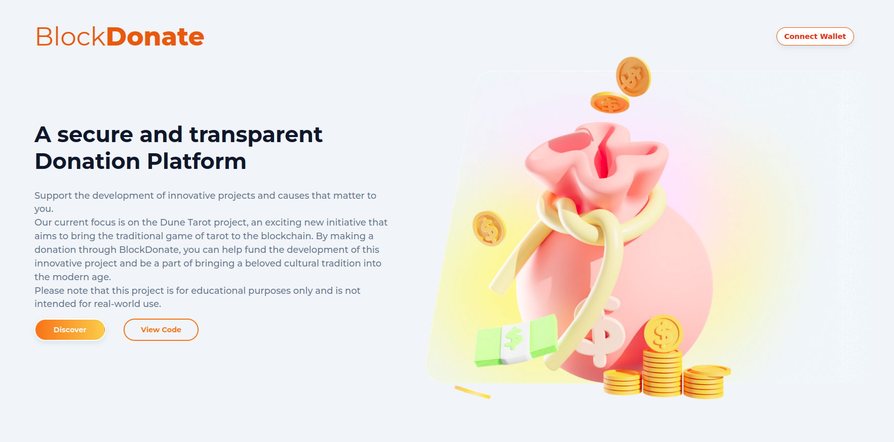

[![LinkedIn][linkedin-shield]][linkedin-url]

<!-- PROJECT LOGO -->
 

  
  </a>
  <h3 align="center">
    <a href="https://blockdonate.vercel.app/">dApp Blockdonate</a>
  </h3>
  

<!-- TABLE OF CONTENTS -->

Table of Contents

<ol>
<li>
    <a href="#about-the-project">About The Project</a>
</li>
<li>
    <a href="#getting-started">Getting Started</a>
    <ul>
    <li><a href="#prerequisites">Prerequisites</a></li>
    <li><a href="#installation">Installation</a></li>
    <li><a href="#usage">Usage</a></li>
    </ul>
</li>
<li><a href="#contact">Contact</a></li>
</ol>
 
<!-- ABOUT THE PROJECT -->

Test the dApp here: [Blockdonate Website](https://blockdonate.vercel.app/)

Check the smart contract here: [Backend repository](https://github.com/julienbrs/hardhat-blockdonate)

 

## About The Project

A decentralized crowdfunding application frontend built using Next.js and React.js. The frontend allows users to create and manage crowdfunding campaigns on the Goerli blockchain. It also allows users to contribute to existing campaigns and view the details of ongoing and past campaigns.

**Possibility to create your own crowdfunding campaign is coming soon**

(<a href="#readme-top">back to top</a>)

## Goal

Please note that this project is for educational purposes only and not meant for production use. The project was built with the goal of providing a user-friendly interface for interacting with the blockchain, making it accessible to a wider audience.

 

  

(<a href="#readme-top">back to top</a>)

<!-- CONTACT -->

## Contact

Bourseau Julien - _2nd year student at Ensimag, 2022_ - julien.bourseau@gmail.com

Project Link: [https://github.com/julienbrs/hardhat-blockdonate](https://github.com/julienbrs/hardhat-blockdonate)

(<a href="#readme-top">back to top</a>)

[linkedin-shield]: https://img.shields.io/badge/-LinkedIn-black.svg?style=for-the-badge&logo=linkedin&colorB=555
[linkedin-url]: https://www.linkedin.com/in/julien-bourseau-ba2239228
